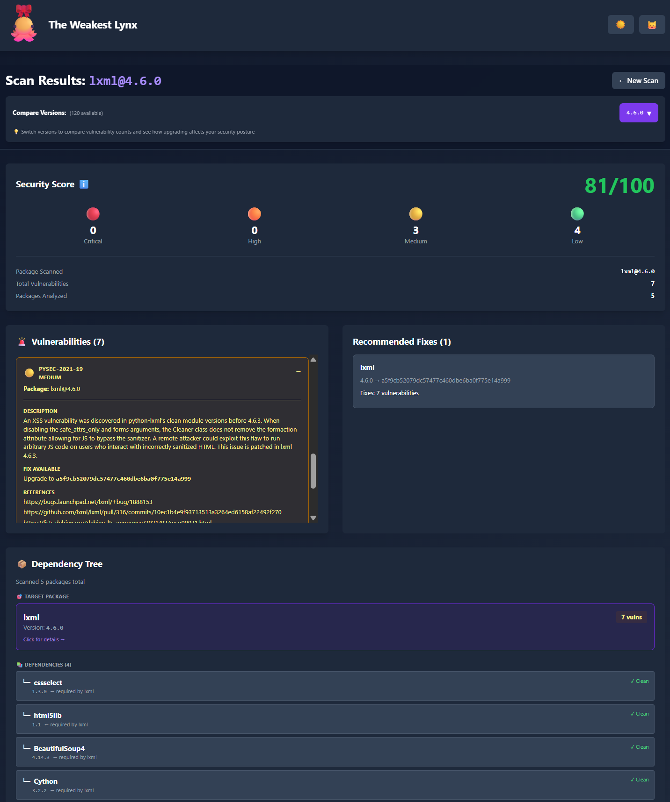

# 🐆 The Weakest Lynx

> A supply chain security auditor that finds your weakest dependencies before attackers do.

```
🐆🔗💀 → 🐆🔗✅
   Your dependencies have dependencies. We find the weak ones.
```



---

## 🚀 Quick Start

### Option 1: Docker (Recommended)

```bash
# Clone and build
git clone https://github.com/ProvenGuilty/vibelympics.git
cd vibelympics/round_2
docker build -t weakest-lynx .

# Run the web UI (HTTPS with HTTP redirect)
docker run -p 8080:8080 -p 8443:8443 weakest-lynx

# Open https://localhost:8443 (HTTP on 8080 redirects to HTTPS)
```

> **Note**: The container uses a self-signed certificate. Your browser will show a security warning - this is expected for local development. Click "Advanced" → "Proceed" to continue.

### Option 2: Local Development

```bash
# Clone the repository
git clone https://github.com/ProvenGuilty/vibelympics.git
cd vibelympics/round_2

# Install dependencies
npm install

# Start development server (frontend + backend)
npm run dev

# Open http://localhost:5173
```

### Option 3: CLI (No Server Required)

```bash
# Install dependencies
npm install

# Scan a package directly from command line
npm run lynx -- scan npm express
npm run lynx -- scan pypi requests --deep
npm run lynx -- scan npm lodash -o json

# Check CLI help
npm run lynx -- --help
npm run lynx -- scan --help
```

### Quick Test with Sample Files

We include test manifests with known vulnerable packages in `test-manifests/`:

```bash
# Test npm manifest (41 vulnerabilities)
npm run lynx -- file test-manifests/package.json -o tree

# Test Python manifest
npm run lynx -- file test-manifests/requirements.txt -o tree

# Export as SARIF for GitHub
npm run lynx -- file test-manifests/package.json -o sarif > report.sarif
```

Or upload them via the Web UI for the full experience with real-time progress.

---

## 📖 What Does It Do?

The Weakest Lynx scans your software dependencies and shows you:

1. **What's installed** — Every package and its transitive dependencies
2. **What's vulnerable** — CVEs with severity scores from the OSV database
3. **Security score** — Overall risk assessment (0-100)
4. **Version comparison** — Switch between versions to see how vulnerabilities change

---

## 🌐 Supported Ecosystems

| Ecosystem | Registry | Example Packages |
|-----------|----------|------------------|
| 🐍 **PyPI** | pypi.org | `requests`, `django`, `flask` |
| 📦 **npm** | npmjs.org | `express`, `lodash`, `axios` |
| ☕ **Maven** | Maven Central | `org.springframework:spring-core` |
| 🐹 **Go** | proxy.golang.org | `github.com/gin-gonic/gin` |
| 💎 **RubyGems** | rubygems.org | `rails`, `nokogiri`, `devise` |

---

## 🎯 Features

| Feature | Description |
|---------|-------------|
| 🔍 **Multi-Ecosystem Scanning** | Scan packages from PyPI, npm, Maven, Go, RubyGems |
| 📁 **Manifest File Upload** | Upload package.json, requirements.txt, go.mod, Gemfile, pom.xml |
| 🔴 **Vulnerability Detection** | Real-time CVE lookup via OSV.dev API |
| 📊 **Security Scoring** | 0-100 score based on vulnerability severity |
| 🌳 **Dependency Tree** | View all transitive dependencies with vuln counts |
| 🔄 **Version Comparison** | Switch versions to compare security posture |
| ⚖️ **Side-by-Side Diff** | Compare two versions with security score diff |
| 📋 **Remediation Suggestions** | Upgrade recommendations with changelog links |
| 📥 **Export Reports** | Download as JSON, Markdown, or SARIF (GitHub) |
| 📺 **Real-time Progress** | Watch scan progress with live log output |
| 🦑 **Animated Mascot** | Because security tools should be fun |

---

## 🎨 User Interface

### Scan Form
- Select ecosystem from dropdown (PyPI, npm, Maven, Go, RubyGems)
- Enter package name (with optional `@version`)
- **Upload manifest files** (drag & drop or click to browse)
- Popular package suggestions for quick testing
- Live search for PyPI packages

### Results View
- **Sticky header** with package name, version, and "New Scan" button
- **Security score** (0-100) with severity breakdown
- **Version selector** dropdown to scan different versions
- **Version diff** - compare security posture between versions
- **Dependency tree** showing all packages with vulnerability indicators
- **Vulnerability list** with CVE details, severity, and fix versions
- **Remediation queue** with upgrade suggestions
- **Export** to JSON, Markdown, or SARIF format

### Manifest Scan View
- **Tabbed navigation** - click packages sorted by vulnerability count
- **Overview tab** - aggregate score and vulnerability summary
- **Per-package results** - full scan with version comparison for each
- **Batch export** - export all results as single report

---

## 🖥️ CLI Reference

The CLI allows scanning packages directly from the command line without starting the web server.

### Commands

```bash
# Scan a package
lynx scan <ecosystem> <package> [options]

# Scan a manifest file
lynx file <path> [options]

# Check server health
lynx health <url>

# Start web server
lynx server [options]
```

### Scan Options

| Option | Description |
|--------|-------------|
| `--ver <version>` | Specific package version (default: latest) |
| `-o, --output <format>` | Output: table, json, markdown, summary, sarif, tree |
| `-d, --deep` | Show per-dependency vulnerability details |
| `-s, --server <url>` | Use remote server instead of local scan |
| `-t, --timeout <sec>` | Timeout in seconds (default: 60) |
| `--verbose` | Enable verbose logging |

### Examples

```bash
# Basic scan
npm run lynx -- scan npm express

# Scan specific version with deep dependency view
npm run lynx -- scan pypi django --ver 2.2 --deep

# Output as JSON for scripting
npm run lynx -- scan npm lodash -o json

# ASCII dependency tree with fix suggestions
npm run lynx -- scan npm express -o tree

# SARIF output for GitHub Security tab
npm run lynx -- scan npm axios -o sarif > results.sarif.json

# One-line summary for CI/CD
npm run lynx -- scan npm axios -o summary

# Scan via remote server
npm run lynx -- scan npm express --server http://localhost:8080
```

### File Scanning

Scan manifest files directly without specifying ecosystem:

```bash
# Python
npm run lynx -- file requirements.txt -o tree

# Node.js
npm run lynx -- file package.json -o tree

# Go
npm run lynx -- file go.mod -o tree

# Ruby
npm run lynx -- file Gemfile -o tree

# Maven
npm run lynx -- file pom.xml -o tree
```

**Supported files:** `requirements.txt`, `package.json`, `go.mod`, `Gemfile`, `pom.xml`

### Example Output

Scan the included test manifest with known vulnerabilities:

```bash
npm run lynx -- file test-manifests/package.json -o tree
```

```
🐆 The Weakest Lynx - Dependency Tree
════════════════════════════════════════════════════════════
package.json@file | Score: 47/100

📦 package.json@file
├── ● handlebars@4.0.0 (10 vulns)
├── ○ axios@0.18.0 (6 vulns)
├── ○ marked@0.3.5 (6 vulns)
├── ○ jquery@2.2.4 (4 vulns)
├── ○ lodash@4.17.11 (4 vulns)
├── ○ moment@2.19.2 (3 vulns)
├── ○ express@4.16.0 (2 vulns)
├── ○ minimist@1.2.0 (2 vulns)
├── ○ node-fetch@2.6.0 (2 vulns)
└── ○ serialize-javascript@1.5.0 (2 vulns)

────────────────────────────────────────────────────────────
⚠ 10 dependencies, 41 vulnerabilities

📋 Suggested Fixes:

  → lodash: 4.17.11 → 4.17.21
    Risk: low | Fixes: 4 vulns

  → express: 4.16.0 → 4.20.0
    Risk: low | Fixes: 2 vulns

  → axios: 0.18.0 → 1.8.2 ⚠ BREAKING
    Risk: high | Fixes: 6 vulns

  → handlebars: 4.0.0 → 4.7.7
    Risk: low | Fixes: 10 vulns

  → marked: 0.3.5 → 4.0.10 ⚠ BREAKING
    Risk: high | Fixes: 6 vulns

  → jquery: 2.2.4 → 3.5.0 ⚠ BREAKING
    Risk: high | Fixes: 4 vulns
```

**Icons:** ✓ Clean | ○ Low | ● Medium | ⚠ High | ✗ Critical

### Exit Codes

| Code | Meaning |
|------|---------|
| 0 | Success, no critical/high vulnerabilities |
| 1 | Critical or high vulnerabilities found |
| 2 | Scan error |

---

## 🔧 API Reference

| Endpoint | Method | Description |
|----------|--------|-------------|
| `/health` | GET | Health check |
| `/api/scan` | POST | Start a new scan |
| `/api/scan/:id` | GET | Get scan results |
| `/api/scan/:id/export?format=markdown` | GET | Export as Markdown |
| `/api/versions/:ecosystem/:package` | GET | Get available versions |
| `/api/config` | GET | Get feature toggles |

### Example: Scan a Package

```bash
# Start scan
curl -X POST http://localhost:8080/api/scan \
  -H "Content-Type: application/json" \
  -d '{"ecosystem": "npm", "package": "lodash", "version": "4.17.0"}'

# Response: {"id": "scan-123", "status": "scanning"}

# Poll for results
curl http://localhost:8080/api/scan/scan-123
```

---

## 📁 Project Structure

```
round_2/
├── Dockerfile                 # Chainguard-based container
├── package.json               # Dependencies
├── vite.config.ts             # Vite bundler config
├── tailwind.config.js         # Tailwind CSS
├── tsconfig.json              # TypeScript config
│
├── src/
│   ├── client/                # React Frontend
│   │   ├── App.tsx            # Main app component
│   │   ├── main.tsx           # Entry point
│   │   ├── components/
│   │   │   ├── LynxMascot.tsx           # Animated squid mascot
│   │   │   ├── scan/
│   │   │   │   └── ScanForm.tsx         # Package input form
│   │   │   ├── results/
│   │   │   │   ├── ResultsView.tsx      # Main results container
│   │   │   │   ├── ScoreCard.tsx        # Security score display
│   │   │   │   ├── DependencyTree.tsx   # Dependency list
│   │   │   │   ├── DependencyModal.tsx  # Dependency details popup
│   │   │   │   ├── VulnerabilityList.tsx # Vuln list
│   │   │   │   ├── VulnerabilityCard.tsx # Individual vuln card
│   │   │   │   ├── VersionSelector.tsx  # Version dropdown
│   │   │   │   ├── RemediationQueue.tsx # Fix suggestions
│   │   │   │   └── ScanMetadataPanel.tsx # Scan details
│   │   │   └── layout/
│   │   │       └── Header.tsx           # App header
│   │   └── styles/
│   │       └── index.css                # Tailwind styles
│   │
│   └── server/                # Express Backend
│       ├── index.ts           # Server entry
│       ├── config.ts          # Configuration
│       ├── logger.ts          # Pino logging
│       ├── types.ts           # TypeScript types
│       ├── routes/
│       │   ├── health.ts      # Health endpoints
│       │   ├── scan.ts        # Scan API + version proxy
│       │   └── config.ts      # Config API
│       └── services/
│           ├── ecosystems/
│           │   ├── pypi.ts    # PyPI resolver
│           │   ├── npm.ts     # npm resolver
│           │   ├── maven.ts   # Maven resolver
│           │   ├── go.ts      # Go resolver
│           │   └── rubygems.ts # RubyGems resolver
│           ├── scanner/
│           │   ├── index.ts   # Scan orchestrator
│           │   ├── osv.ts     # OSV API client
│           │   └── score.ts   # Score calculator
│           ├── remediation/
│           │   ├── engine.ts  # Remediation engine
│           │   ├── changelog.ts # Changelog fetcher
│           │   └── patterns.ts # Breaking change patterns
│           └── export/
│               └── markdown.ts # Markdown exporter
│
└── public/
    └── lynx-logo.svg          # Logo
```

---

## 📊 Code Stats

| Category | Lines | Files |
|----------|-------|-------|
| **Frontend (React)** | ~1,700 | 14 |
| **Backend (Express)** | ~1,500 | 14 |
| **Total TypeScript** | ~3,260 | 28 |

---

## 🛡️ Security

- **OSV Database** — Real-time vulnerability data from Google's OSV
- **Version Filtering** — Only shows vulnerabilities affecting your specific version
- **No Secrets in Code** — All API keys via environment variables
- **Chainguard Base** — Minimal attack surface container image
- **HTTPS by Default** — TLS encryption with automatic HTTP→HTTPS redirect
- **Production Clean** — Zero vulnerabilities in production builds and runtime
- **CORS Restricted** — API access restricted to allowed origins in production

> **Note on `npm audit`**: The dev dependency `esbuild` (via Vite) reports a moderate vulnerability ([GHSA-67mh-4wv8-2f99](https://github.com/advisories/GHSA-67mh-4wv8-2f99)) that **only affects the local development server** (`npm run dev`). This does not affect production builds, the Docker container, or end users. The fix requires Vite 7.x which is incompatible with Chainguard's non-root containers.

---

## ⚙️ Configuration

| Variable | Description | Default |
|----------|-------------|---------|
| `PORT` | HTTP server port | `8080` |
| `HTTPS_PORT` | HTTPS server port | `8443` |
| `ENABLE_HTTPS` | Enable HTTPS with HTTP redirect | `true` in production |
| `LOG_LEVEL` | Log verbosity | `info` |
| `ALLOWED_ORIGINS` | Comma-separated CORS origins | localhost ports |

---

## 🐆 Why "The Weakest Lynx"?

- **Lynx** — Sharp-eyed predator that spots what others miss
- **Links** — Your dependency chain is only as strong as its weakest link
- **Wordplay** — Security tools don't have to be boring

---

## 👥 Team

**Team ProvenGuilty**
- [@ProvenGuilty](https://github.com/ProvenGuilty)
- [@mrshaun13](https://github.com/mrshaun13)

---

## 📜 Tech Stack

| Component | Technology |
|-----------|------------|
| Container | Chainguard Node |
| Frontend | React 18 + TypeScript + Vite |
| Styling | TailwindCSS |
| Backend | Express.js + TypeScript |
| Vuln Data | OSV.dev API |
| Logging | Pino |

---

## 📝 License

MIT

---

*Built for Vibelympics 2025* 🐆🔗✅
